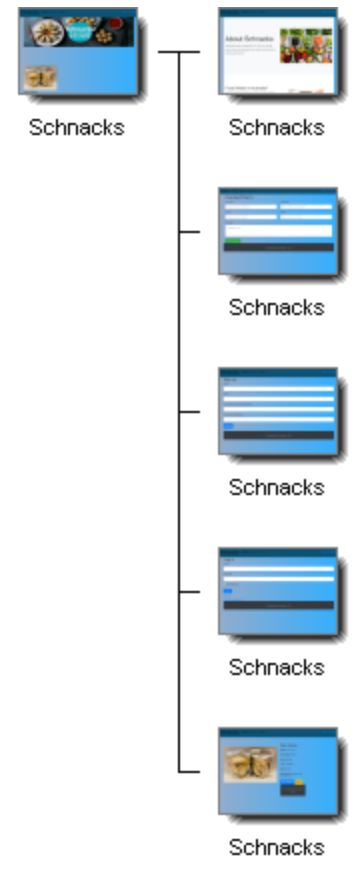
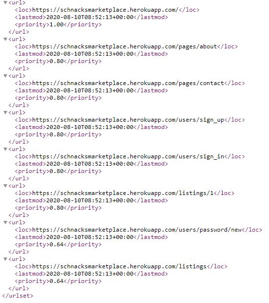
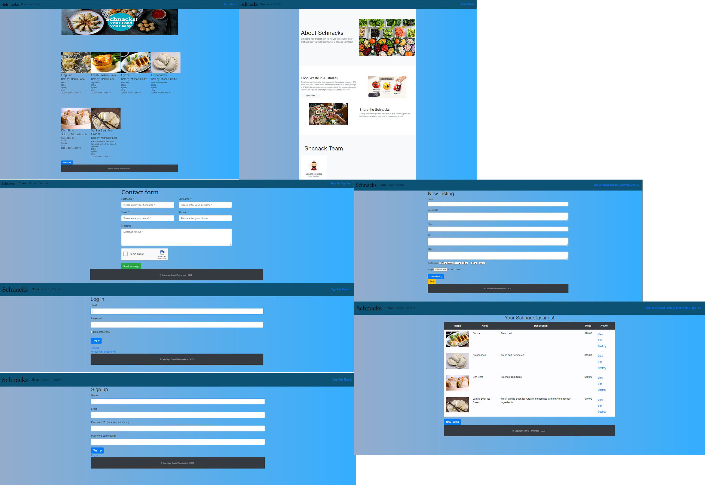
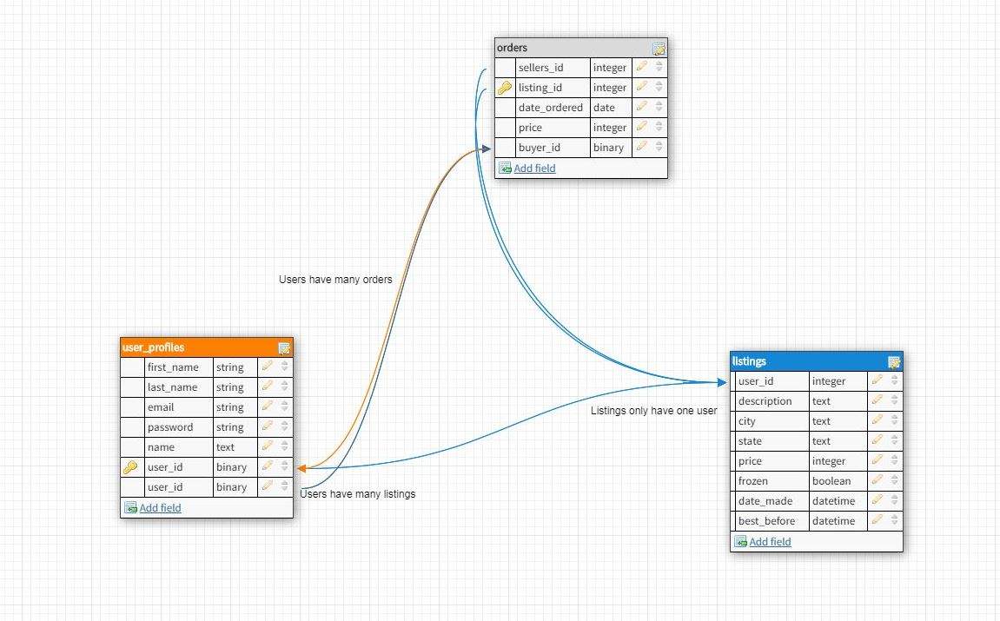
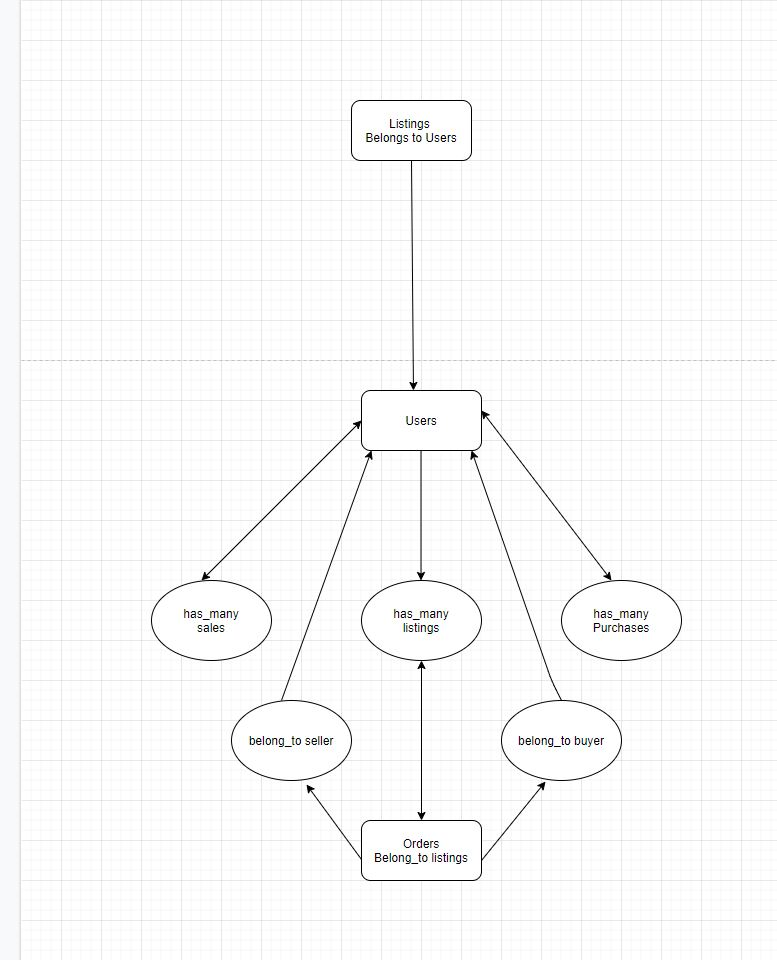
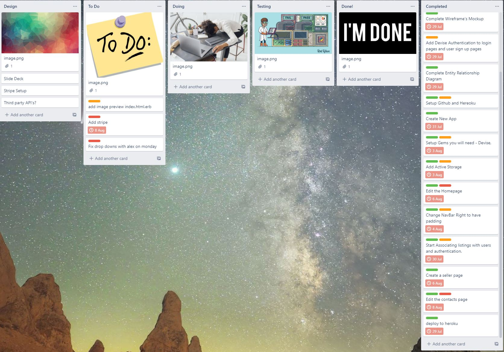

### **<u>Schnacks Marketplace - T2A2</u>**

### **<u>Identification of the *problem* you are trying to solve by building this particular marketplace *app*.</u>**

During the pandemic, people took to their kitchens and asserted their ingenuity and new found love for cooking by sharing their masterpieces in the name of food. With that brave goal in my mind my marketplace application was born, for people to share their home cooked food to others, in the name of sharing, learning and of course cooking. This application as much of a marketplace it is, was essentially made to return the costs of labor and costs back to the chef, allowing people all over Australia to indulge in the brilliance of others and not have to source fast food and other delicacies while we are all in lockdown. Hopefully this allows people to get into their kitchens more and enjoy the brilliance that is home cooked food, whether frozen for convenience or ready on pickup. 

### **<u>Why is it a *problem* that needs solving?</u>**

My marketplace aims to serve people respectively in their local community by allowing people near them to gain access to food they would not usually have, allows individuals to do something with their time, especially during a pandemic and also lessens the burden of big grocery shops and their food wastage. These are all relevant problems when thought about individually as firstly, you allow people to be productive and serve their local community by allowing others serve culturally significant dishes or whatever interests they have in cooking. This also allows people in the community to access such food at reasonable prices, without having to go to restaurants (especially when you cannot like during a pandemic), or trying to make it themselves. People in the community also get paid for their efforts which may be a reasonable source of income. Secondly food wastage amongst leading grocery stores in Australia is extremely large, and is estimated to be around $20 billion dollars each year. Amongst this food wastage, over 710. 000 people rely on food services to gain access to eating alone in Australia at reasonable prices, making it hugely insecure commodity. Companies like Oz harvest have tried to mitigate all of these costs, but there is still a great deal more work to do. If a sharing economy for food did exist, I personally think not only would this strengthen communities especially in tougher times, but also serve the environment, food wastage and the vastly insecure population of people who cannot access wholesome homecooked food in many areas. 

### **<u>A link (URL) to your deployed *app* (i.e. website)</u>**

​																		https://schnacksmarketplace.herokuapp.com/

### **<u>A link to your GitHub repository (repo).</u>**

​																	https://github.com/dannyfern/Schnacks-Marketplace

### **<u>Description of your marketplace *app* (website)</u>**

1. The purpose of this application was to build a marketplace application in accordance with the designated criteria, and my own expectations of what I could personally achieve in the time. Given the knowledge I have acquired in the last 8 weeks of studying rails application development, I set myself a goal of not only focusing on the marking criteria as this is the reality of programming and application development but to further understand the obscurities that can only be developed when practical work is committed by yourself rather than theory. Furthermore my application idea I think has real world application and was practical in its purpose to achieve its goals stated above. 

2. The functionality and features of my application include, a web based application that users can interact with that allows users to create listings of food items they make and sell them in their respective states. Users can browse listings and also purchase any given listings with the implementation of Stripe payment. Additional features of my website include being able to track your listings, and browse your sell and purchase history on your profile. Features in the application itself included many gems including devise, which was vital to all of the validation of users, postgres which allowed me to track my database and link primary/foreign keys and AWS for image upload capabilities. 

3. 

   

4. 

5. Target Audience of my website is any individual that is interested in home cooking or likes the idea of buying produce from people in their community. This also supports the idea of individuals who have concerns over the environment and food wastage who want to support individuals rather than big business in buying produced meals. 

6. **Tech Stack of my application include:** 

   - HTML

   - CSS

   - JAVASCRIPT

   - RUBY/RAILS

   - SCSS

     **Third Party** 

   - HEROKU 

   - STRIPE,

   - AWS

   - POSTGRESQL

   - PGADMIN

   - GITHUB

   - TYPORA

   - BALSAMIQ WIREFRAMES.

### **<u>User stories for your *app*</u>**

1. Users are able to create an account and login.
2. Once logged in Users are able to gain full functionality of the application.
3. Users can browse through listings, create listings and also purchase listings when logged in. 
4. Once users have done any of the above they can search through there own listings, purchases and order history enabling the user to get information about who is purchasing their listings, their own purchases and their own current listings. 
5. Application and User story is based around a marketplace very much like eBay or Gumtree without the ability to bid on products or message individuals. 

### **<u>Wire Frames</u>**

### ***Entity Relationship Diagram***

### **High-Level Components**

**Heroku** 

Heroku as a third party application is chosen because it is feature rich in the service it provides. As a development platform, Heroku serves to manage, scale and work with developers in making an ecosystem that is easy to navigate. Being able to manage data services including postgres built in amongst others and extending database delivery with add-on's for developers makes Heroku a very viable choice when browsing data platforms to host your applications. 

**AWS**

Amazon web services apart from being one of the most cost friendly cloud computing services is also arguably the most reliable service for any company needs. Amazon web services is completely flexible with operating systems, programming languages, databases and any other services you need making it seamless when migrating to AWS in your application. Amazon web services are also known for complete reliability with 99.9% uptime on servers and completely secure infrastructure for your application. 

### **Detail any third party services that your *app* will use**

- HEROKU is used as my deployment application due to its feature rich service, easy deployment and inbuilt Postgres. Being able to manage my application and migration was extremely seamless with Heroku making it the most viable choice for my application. 
- STRIPE as a payment gateway allowed my application to have its own payment forms, also entailing a quick easy setup. Stripe is considered secure and doesn't host any data on your servers making it very secure in terms of breaches. 
- AWS was used for image uploading and was very easy to setup and use. Hosting a bucket was free for 5GB of space making it a very enticing option, and amazon is known for being extremely reliable and flexible. 
- POSTGRESQL was used due to its object-relational database, allowing my application to define my objects and how they interact with other structures. PGADMIN in correlation with postgres was very easy to navigate and discern how my ID's were interacting with my models. PostgreSQL is extensible recommended over other SQL servers due to its data models, types and structures and how scalable, secure and capable it is when developing and handling different environments compared to its counterparts. 
- DEVISE  gem was the most flexible solution towards having inbuilt authentication and validity on my application. Being able to install this gem was extremely easy and the docs and parameters for the rails application were extremely easy to configure and initialize. 
- BOOTSTRAP was extremely helpful in configuring my CSS and making my application scalable on multiple devices. Bootstrap was also very easy to install and configure and the docs relating to implementation were extremely easy to use and implement on my application. 

### **Describe your projects *models* in terms of the relationships (active record associations) they have with each other**

My projects model looks as such; 

My active records start with listings in which they belong only to one user, in which they also have many orders. From there Users have control over having many listings, sales and purchases. Orders are then linked back to my listings records in which they discern the buyer of the listing from the user being logged in and also the seller of the listing from it being linked to the listings record in which the user created. Once these fields are filled out every listing is linked to a User, in which they can track the buyer, or the User buys listings which are linked back to their own user account. 

### ***Database Relations in your application*** 

Database relations in PostgreSQL are as follows;

1. Users have a primary key linked to their account by their account sign up and specifically related to their email ID. 
2. From here that email ID is used to create listings from their own account in which that listing ID is a foreign key linked to their unique user_ID in the the form of an integer. This way all users are identified and when they create a listing they are attributed their user_ID. 
3. When a user searches through listings, and decides to purchase an item that user is assigned a buyer_id against that unique listing which is also attributed to the user that created that listing. 
4. The user that created that listing already has the unique listing ID that is associated with their user_ID but when purchases is also assigned a unique seller_id to keep track of that listing in regards to the buyer and the seller association.

My database function simplistically in a sense, allowing users to create a profile to become a joined buyer and seller, in which unique ID's are associated with listings, buyers, sellers and users. 

### **Provide your database schema design**

###  **Describe the way tasks are allocated and tracked in your project**

Trello was used to track all significant portions of my application and were segmented into the following division's for practical purposes.

- Design - Was used to initially create all relevant cards that needed attending to as my application came to fruition. All these design aspects were the practical parts of my application that needed to be worked on. 
- To Do - Once created, to-do was used to move cards into the section to begin working on and have relevant completion dates depending on the amount of time I allocated to them.
- Doing - If a card was completed during that time it would be moved to testing, otherwise uncompleted tasks that needed completed or required assistance were moved to the doing portion of my project. 
- Testing - Testing was used to test the relevant aspects of cards that were completed and needed to be seen and deployed to make sure they functioned. Depending on the outcomes they were either moved to done or back to doing for revision. 
- Done - Done card was for all aspects of my project that were considered 'done' and I could move onto other parts of my project. They were still in limbo here as I would have one last check before moving them into the completed section of my board. 
- Completed - As the title suggests, completed was for all relevant aspects of my application that were considered by me to be done and could no longer be seen as relevant to allocate further time, testing or revision to. 